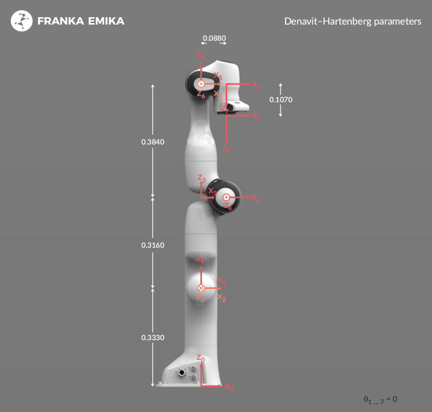
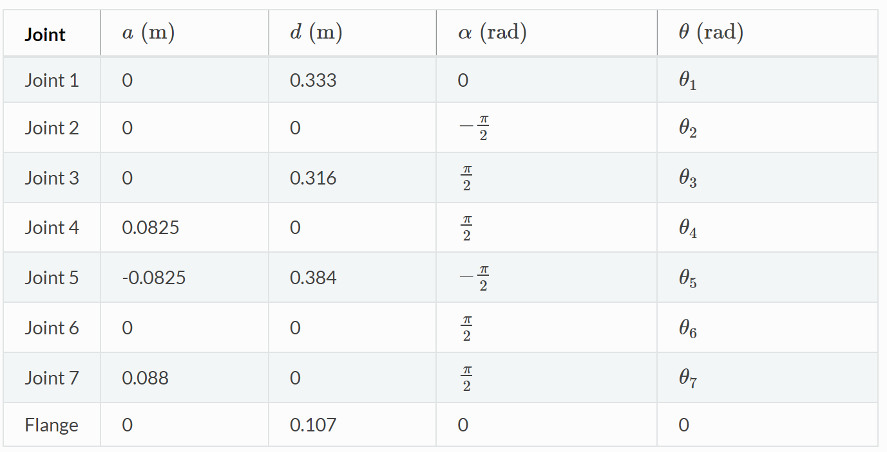

# Final project

* [Final project](#final-project)
  * [Update](#update)
  * [Foundations](#foundations)
    * [Ubuntu virtual machine](#ubuntu-virtual-machine)
    * [Ubuntu](#ubuntu)
    * [How to use Github to keep tracking the change of code version?](#how-to-use-github-to-keep-tracking-the-change-of-code-version)
    * [Docker](#docker)
  * [Set up your Environment](#set-up-your-environment)
  * [Simulator installation](#simulator-installation)
    * [Clone the Repository](#clone-the-repository)
    * [Set up Docker](#set-up-docker)
    * [Start Docker](#start-docker)
    * [Set up Environment inside the Docker Container](#set-up-environment-inside-the-docker-container)
  * [Explore the simulator](#explore-the-simulator)
  * [Project](#project)
    * [Requirement](#requirement)
    * [DH parameter of Panda robot](#dh-parameter-of-panda-robot)
    * [Program and test your solution](#program-and-test-your-solution)
    * [Criteria](#criteria)
  * [Trouble shooting](#trouble-shooting)
    * [How to deal with the version update?](#how-to-deal-with-the-version-update)


---

Hi all, 

Congratulations on getting into the most interesting part of this course! You could use what you have learnt in class to complete a real robot manipulation task, and this is also the chance to check whether you have understand those knowledge. Maybe you'll be interested in robotics through this practical project, then welcome to join us and do something that changes the world! So why still hesitate? Take action now!

Junjia Liu


---

## Update

1. 2021.11.22 - **Some students told me that they do not have a computer with a Nvidia GPU. So, I tried to remove Nvidia's dependence from the docker file. However, I found that the Pybullet simulator is mainly rely on the OpenGL, which has to require a Nvidia driver.** 

2. 2021.11.22 - If you have any question about this project, please try to learn and use the `issues` in Github to ask your questions so that I can reply in time and let other students who encounter the same problem know the solution at the same time.

   

---


## Foundations

> **Notice:** If you are familiar with git, Github, Docker, Linux, virtual machine, you can skip this chapter and start from the second chapter *Set up your Environment*.

### Ubuntu virtual machine

**Step 1:** Since this project requires Docker and Ubuntu environment, and if you are just using a Windows PC, I highly recommend you install a virtual machine in your Windows as your first step. The virtual machine I recommend is [vmware](https://www.vmware.com/products/workstation-pro.html).


**Step 2:** After installing your virtual machine, please follow [this video](https://www.youtube.com/watch?v=QCSyqrgM0sU) to install a **Ubuntu 18.04** on VMware in your Windows.

> **Cheers!** You have your first Linux system!


### Ubuntu

In Ubuntu, the only thing you need to know is how to use the **Terminal**. Everything can be done by several terminal commands.

**Step 3:** Here is a command [tutorial](https://ubuntu.com/tutorials/command-line-for-beginners#1-overview) for beginners, you can take a quick look and understand the basic usage methods. 


### How to use Github to keep tracking the change of code version?

> **Notice:** From here, forget about your Windows, everything is in Ubuntu!

Since this project contains large amount of dependent packages and various unexpected errors may occur during your installation and use, it is convenient for us to use **Github** to host our code. There are two advantages: 

1. I can modify the bug you faced and re-push (upload) the correct version of code rapidly;
2. You can re-pull (download & update) the modification in the correct version easily, rather than the whole code repository again and again.

**Step4:** Here I highly recommend to use the **[GitKraken](https://support.gitkraken.com/how-to-install/)** to clone (initial download) the project repository in your Ubuntu system and keep tracking the version changes.

Or simple git command is also recommended. Here is a [tutorial](https://www.geeksforgeeks.org/how-to-install-configure-and-use-git-on-ubuntu/).

> **Cheers!** You're doing the same cool things as a programmer.


### Docker 

**Step5:** Get familiar with Docker [ [English](https://docker-curriculum.com/) | [Chinese](https://www.runoob.com/docker/docker-tutorial.html) ].


## Set up your Environment

In order for your solution to be executable on your local machine, I provide you a docker image with some pre-installed software. You need to develop and test your solution within this docker image. 

**Step6:** So first you need to install the following requirements for using Docker.

- The software package must run on a computer with a NVIDIA GPU.
- Proper NVIDIA driver must be installed (https://phoenixnap.com/kb/install-nvidia-drivers-ubuntu)
- Docker must be installed (https://docs.docker.com/engine/install/ubuntu/)
- NVIDIA container runtime must be installed (https://www.celantur.com/blog/run-cuda-in-docker-on-linux/)
- Ubuntu 18.04 and Ubuntu 20.04 are tested and recommended, other Linux distribution may also work.


## Simulator installation

### Clone the Repository

There are some submodules in the software package, and you need to clone the repository recursively.

**Step7:** Clone the project repository using the Terminal.

```
git clone https://github.com/Skylark0924/advanced_robotics_project.git --recursive
```

or

```
git clone https://github.com/OCRTOC/OCRTOC_software_package
cd OCRTOC_software_package
git submodule update --init --recursive
```


### Set up Docker

**Step8:** Pull the Docker image or build it from docker file. 

> **Notice:** This will take **really a long time** (about 1~3 hours), so you can leave the virtual machine alone **(but not shutdown it)** and do something else. 


- Option 1  (suggested, faster): Build docker image from docker file:

  ```
  # Jump to the path you clone the project repository
  cd [YOUR_REPO_PATH]
  cd docker
  bash build.sh ocrtoc_pb_g:v1
  ```

- Option 2: Pull the pre-built docker image from either of the following sources:

  ```
  docker pull registry.cn-hangzhou.aliyuncs.com/ocrtoc2021/release:2.1
  ```

  or

  ```
  docker pull registry.us-west-1.aliyuncs.com/ocrtoc2021/release:2.1
  ```

  

### Start Docker

**Step9:** I provide two scripts for creating and executing the docker image. Please modify the **name** and **path** in the scripts according to your own needs.

```
# Jump to the path you clone the project repository
cd [YOUR_REPO_PATH]

# Create docker container
bash tools/create_container.sh

# Enter the docker container
bash tools/exec_container.sh
```

When your host operating system restarts, the docker will not restart automatically. I also provide another script for you to restart the docker.

```
# Restart docker container
bash tools/start_container.sh

# Enter the docker container
bash tools/exec_container.sh
```


### Set up Environment inside the Docker Container

**Step10:** Since some parts of the environment are given as source code, they cannot be installed while building the docker image. You need to run the following commands to set up the environment. However, you don't need to run them when you restart the docker container.

```
# Enter the docker container
bash tools/exec_container.sh

## In the docker image
cd /root/ocrtoc_ws/src/tools
bash setup_env.sh
```

> **Content of the Docker Image**
>
> - Operating System: Ubuntu 18.04
> - ROS melodic-desktop-full
> - moveit 1.0.7
> - CUDA 11.2
> - PyBullet 3.0
> - ceres-solver 2.0
> - colmap 3.7
> - pycolmap 0.0.1
> - torch==1.8.2, torchvision==0.7.0, open3d==0.12.0 for python3 and open3d==0.9.0 for python
>
> Now you have finished setting up the environment, and you can try to run the baseline solution.


> **Cheers!** By now you have completed all the installation steps, let's enjoy the exploration!


## Explore the simulator

**Step11:** Open it! Open 3 terminals and execute the following commands in each of the terminal.

```
# In the first terminal, run the following to open the docker image
bash tools/exec_container.sh

# In the docker image
# Start the PyBullet simulator and ros interface
roslaunch ocrtoc_task bringup_simulator_pybullet.launch task_index:=0-0


# In the second terminal
bash tools/exec_container.sh

# In the docker image
# Start moveit and rviz
roslaunch panda_moveit_config ocrtoc.launch


# In the third terminal
bash tools/exec_container.sh

# In the docker image
# Start manipulator interface node
rosrun ocrtoc_common manipulator_interface_node.py
```


You may find a `motion planning` plugins is shown in the `rviz`, which is a motion planning framework called `MoveIt`. This framework is usually used in the daily robotics research, since it contains many mature robotics algorithms such as ... and allows us to execute the robot motion without disturbed by trivia. Here is the manual of the `MoveIt`, you can take a look but do not waste too much time: http://docs.ros.org/en/kinetic/api/moveit_tutorials/html/doc/quickstart_in_rviz/quickstart_in_rviz_tutorial.html

**However**, in this project, we expect you can practice what you have learned in this course, rather than using some open source packages.


## Project

### Requirement

**In this project, you are required to implement a kinematic control on a 7-DOF [Franka Panda](https://frankaemika.github.io/docs/) robot to track a desired trajectory.**


### DH parameter of Panda robot

The Denavit–Hartenberg parameters of this robot are given as follows:






### Program and test your solution

Though there are a mass of scripts in this project, the only one you need to consider and modify is `ocrtoc_common/test/trajectory_tracking.py`. 

```
# Jump to the path of your solution
roscd ocrtoc_common/test

# Plot the desired traj in rviz (python2)
python test_dsr_traj_vis.py

# Run your solution (python3)
python3 trajectory_tracking.py
```

> **Notice:** Every time you try to test your code, please make sure the three terminals mentioned in the **Step11** is running normally! Otherwise, you will receive a plenty of errors.


### Criteria

1. **(20%)** Finish the forward kinematic function `def fk(self, q)`;
2. **(20%)** Finish the Jacobian function `def jacobian(self, q)`;
3. **(55%)** Finish the kinematic control function `def control(self);
4. **(5%)** Plot your results as I mentioned in the `def traj_vis(self)` ;
5. **Bonus (+10%)** Take your code and come to Academic Building 1 (2F) to test your code on the real Panda robot.

**Please submit your `trajectory_tracking.py` and a document which contains your result figures.**


## Trouble shooting

1. If you are using the recommended installation and your terminal is stuck here, don't be panic, it just takes a while. 

   

2. If you cannot find anything in `\root\ocrtoc_ws\src`, it probably be the mistake in `tools\create_container.sh`. You need to modify the **name** and **path** in the scripts according to your own needs. 

   So you need to modify `$HOME/OCRTOC_software_package:/root/ocrtoc_ws/src` -> `<your absolute path of the OCRTOC_Software_package directory>:/root/ocrtoc_ws/src`.


3. When you run `rosrun ocrtoc_common manipulator_interface_node.py` and get an error like this:

   ```
   Traceback (most recent call last):
     File "/root/ocrtoc_ws/src/ocrtoc_common/scripts/manipulator_interface_node.py", line 8, in <module>
       m_i = ManipulatorInterface('panda_arm')
     File "/root/ocrtoc_ws/src/ocrtoc_common/src/ocrtoc_common/manipulator_interface.py", line 25, in __init__
       self.move_group = moveit_commander.MoveGroupCommander(group_name)
     File "/opt/ros/melodic/lib/python2.7/dist-packages/moveit_commander/move_group.py", line 66, in __init__
       name, robot_description, ns, wait_for_servers
   RuntimeErrorshutdown request: [/manipulator_interface_node] Reason: new node registered with same name
   : Unable to connect to move_group action server 'move_group' within allotted time (5s)
   ```

   please try to exit the docker and get in again.

   ```
   # In the docker image
   exit
   
   # Out of the docker
   cd [YOUR_REPO_PATH]
   bash tools/exec_container.sh
   ```

   

### How to deal with the version update?

If there are some issues in this repository, I will fix it and notify you via email. You don not need to execute Step1~Step10 again, the only two things you need to do is to pull the modification and execute **Step10** to renew your environment.

```
# In your repo path
git pull  # you might face a merge alert, handle it yourself

# Enter the docker container
bash tools/exec_container.sh

## In the docker image
cd /root/ocrtoc_ws/src/tools
bash setup_env.sh
```

